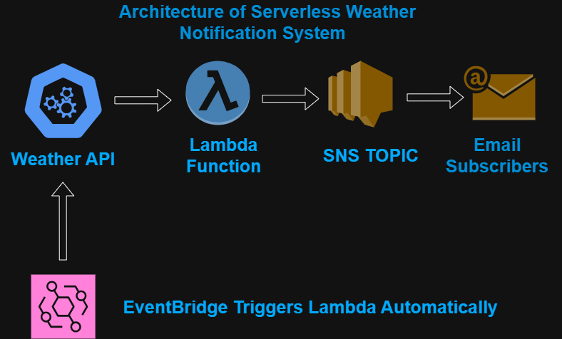
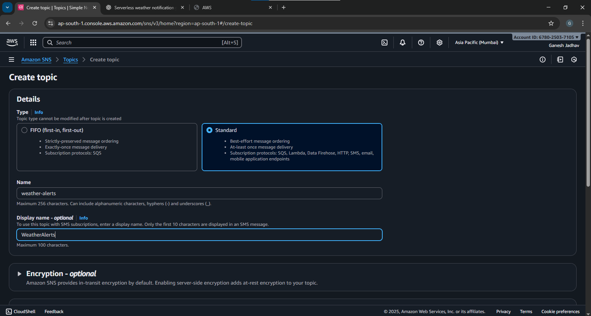
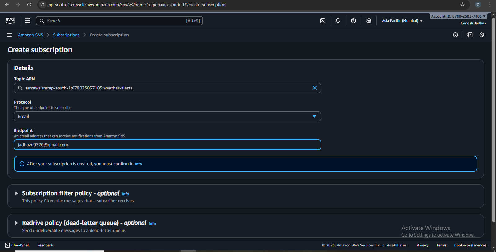
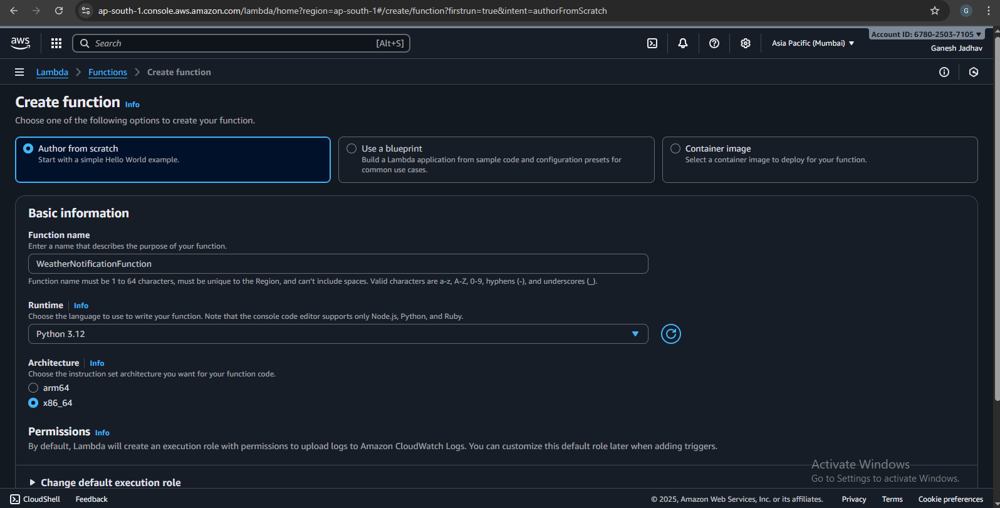
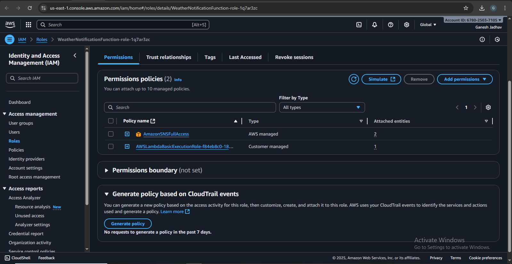
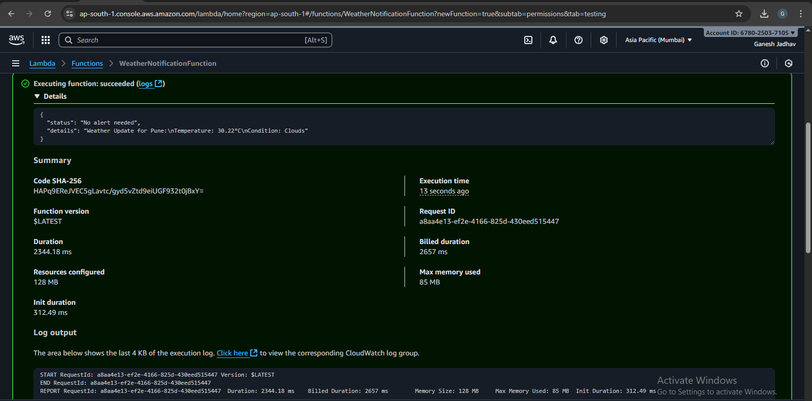
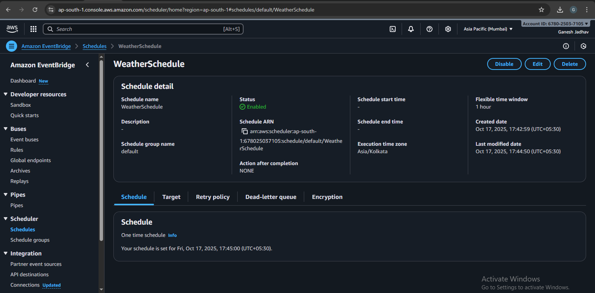
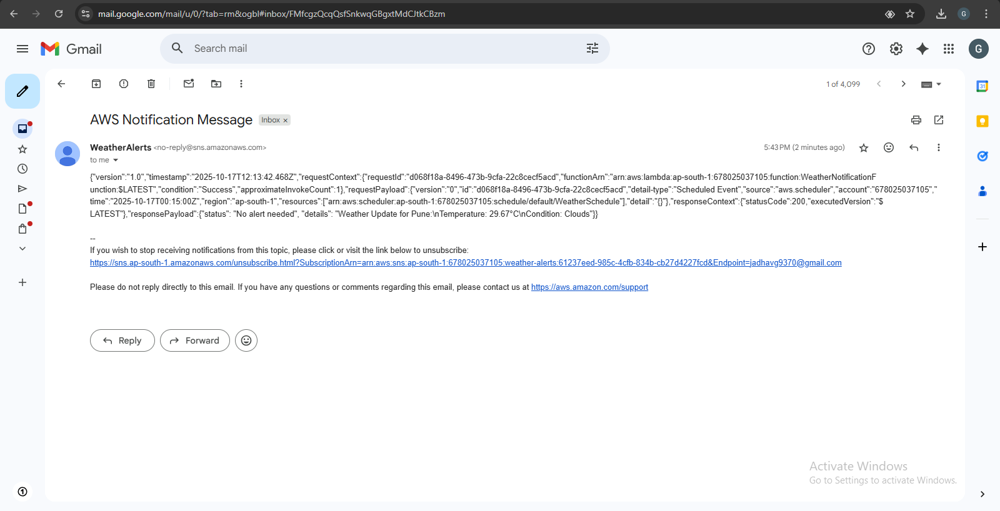

# 🌤️ Serverless Weather Notification System

## Overview
This project is a **Serverless Weather Notification System** built using **AWS Lambda**, **Amazon SNS**, and **EventBridge**.  
It automatically fetches the weather for a specific city and sends **email alerts** when certain conditions are met, such as rain or high temperature.  

This project demonstrates **serverless architecture**, **cloud automation**, and **real-time notifications** — perfect for cloud and DevOps learning.

---

## Features
- Fetches **live weather data** from OpenWeatherMap API.  
- Sends **email alerts** via Amazon SNS.  
- Fully **automated** using EventBridge (scheduled triggers).  
- Easy to configure for **any city**.  
- Serverless solution: no need for servers or infrastructure management.

---

## Architecture



```

**Components:**
1. **AWS Lambda**: Runs the Python code to fetch weather data and publish alerts.  
2. **Amazon SNS**: Sends email notifications to subscribers.  
3. **Amazon EventBridge**: Automatically triggers Lambda on a schedule.  
4. **OpenWeatherMap API**: Provides real-time weather information.

---

## Technologies Used
- AWS Lambda (Python 3.x)  
- Amazon SNS (Email notifications)  
- Amazon EventBridge (Scheduling)  
- OpenWeatherMap API  
- Python Standard Libraries (`urllib`, `boto3`)  

---

## Setup Instructions

### Step 1: Create an SNS Topic
1. Go to **AWS SNS Console → Topics → Create topic**.  
2. Choose **Standard** type.  
3. Name: `weather-alerts`  
4. Click **Create topic**. 




### Step 2: Subscribe to the Topic
1. Click your topic → **Create subscription**.  
2. Protocol: `Email`  
3. Endpoint: Your email address  
4. Check your email and **confirm the subscription**.




### Step 3: Create a Lambda Function
1. Go to **AWS Lambda → Create function → Author from scratch**.  
2. Function name: `WeatherNotificationFunction`  
3. Runtime: Python 3.12  
4. Permissions: Create a new role with basic Lambda permissions 



### Step 4: Add Environment Variables
| Key | Value |
|-----|-------|
| WEATHER_API_KEY | Your OpenWeatherMap API key |
| CITY_NAME | City you want to monitor |
| SNS_TOPIC_ARN | Your SNS Topic ARN |

### Step 5: Add Lambda Code
Paste this code in `lambda_function.py`:

```python
import os
import json
import boto3
import urllib.request

def lambda_handler(event, context):
    api_key = os.environ['WEATHER_API_KEY']
    city = os.environ['CITY_NAME']
    sns_topic_arn = os.environ['SNS_TOPIC_ARN']

    sns_client = boto3.client('sns')
    
    url = f"http://api.openweathermap.org/data/2.5/weather?q={city}&appid={api_key}&units=metric"
    with urllib.request.urlopen(url) as response:
        data = json.loads(response.read())
    
    temperature = data['main']['temp']
    weather_condition = data['weather'][0]['main']

    message = f"Weather Update for {city}:\nTemperature: {temperature}°C\nCondition: {weather_condition}"
    
    if temperature > 35 or weather_condition.lower() in ['rain', 'storm']:
        sns_client.publish(
            TopicArn=sns_topic_arn,
            Subject=f"Weather Alert: {weather_condition} in {city}",
            Message=message
        )
        return {"status": "Alert sent", "details": message}
    else:
        return {"status": "No alert needed", "details": message}
```

### Step 6: Attach SNS Permissions
1. Go to **Configuration → Permissions → Execution Role**  
2. Attach the **AmazonSNSFullAccess** policy.




### Step 7: Test Lambda
1. Click **Test → Configure test event → Save**  
2. Click **Test**  
3. Check your email for alerts.



### Step 8: Automate Using EventBridge
1. Go to **EventBridge → Rules → Create rule**  
2. Schedule: `rate(1 hour)` or cron expression  
3. Target: Lambda function → `WeatherNotificationFunction`  
4. Create rule → Lambda runs automatically on schedule.



---
## Screenshots 

**SNS confirmation email**



---

## How It Works
1. EventBridge triggers Lambda on a schedule.  
2. Lambda fetches weather data from OpenWeatherMap API.  
3. Checks for conditions like **rain or temperature > 35°C**.  
4. If conditions match → publishes alert to SNS.  
5. SNS sends **email to all subscribed addresses**.

---

## Learning Objectives
- Understand **serverless architecture** using AWS Lambda.  
- Learn **cloud-based event scheduling** with EventBridge.  
- Work with **Amazon SNS for notifications**.  
- Integrate **external APIs** in serverless applications.  
- Build **automated and scalable cloud projects**.

---

## Future Enhancements
- Add **multiple cities** monitoring.  
- Use **HTML emails** for better formatting.  
- Log all alerts in **DynamoDB**.  
- Add **SMS notifications** along with email alerts.

---

## Author
**Ganesh Jadhav** – Aspiring Cloud & AWS Developer
📧 Email: [jadhavg9370@gmail.com](mailto:jadhavg9370@gmail.com)
🔗 LinkedIn: [Ganesh Jadhav](https://www.linkedin.com/in/ganesh-jadhav-30813a267/)


